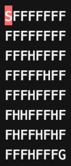

# Reinforcement-Learning
 This repository demonstrates the implementation of SARSA, Q-Learning and Expected SARSA to the [GYM - FrozenLake8x8-v0](https://gym.openai.com/envs/FrozenLake8x8-v0/), an ```OpenAI``` environmental simulator. The work in this repository is inspired by [the article](https://towardsdatascience.com/reinforcement-learning-temporal-difference-sarsa-q-learning-expected-sarsa-on-python-9fecfda7467e) by Vaibhav Kumar.

# Frozen Lake Environment 


The frozen lake environment is an 8x8 grid world and has total 64 states. In each episode the agent starts at ```S``` and the episode terminates when it reaches either hole ```H``` or goal ```G```. The reward for reaching the goal is 1 while going to any other state results in 0 reward.

All three algorithms are implemented as given in [Reinforcement Learning: An Introduction](https://web.stanford.edu/class/psych209/Readings/SuttonBartoIPRLBook2ndEd.pdf) by Richard S. Sutton and Andrew G. Barto.

# TD Q-Learning 

The figure above illustrates the results obtained with Q - Learning.
* The repository is still being updated for a better navigation through the code.
